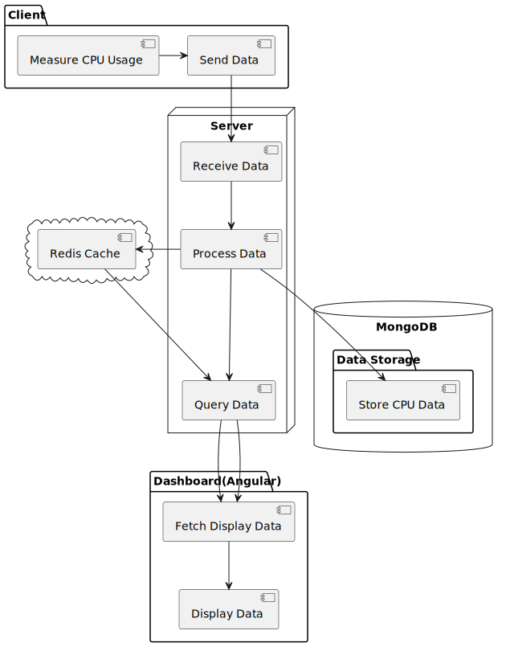

# Files for you

# System Design

## Components
There are three projects in this system Server, Client and Dashboard.

# Server
This is the server based on socket.io, which polls the client's metrics(currently cpuUsage) and saves it to the Mongo database and then to redis.
Mongodb database is used to store the historical data and can be queries using following rest endpoints

Endpoints:
- /cpu-usage/recent => gets recent data from redis
- /cpu-usage/client => gets cpu usage data by client id and date range
- /cpu-usage/clients => gets clients having high cpu usage more than threshold within a date range.

Redis is used as a fast storage which holds the current data for 1 hour(3600s) for real time data.

# Client
The client actuallu generates some random numbers mimicked as cpu usage to send to the server through socket connections
You can create multiple clients by running the client project multiple times in multiple terminals.

# Dashboard (powered by Angular)
The dashboard with minimum features is created on Angular which actually simulates the API endpoints mentioned in the server.
This dashboard shows the following things
- The real time current cpu usage data for the connected clients within 1 hour(3600s) of time
- Form to query Cpu usages by client id and date range
- Form to query clients with higher cpu usage above threshold and within a date range